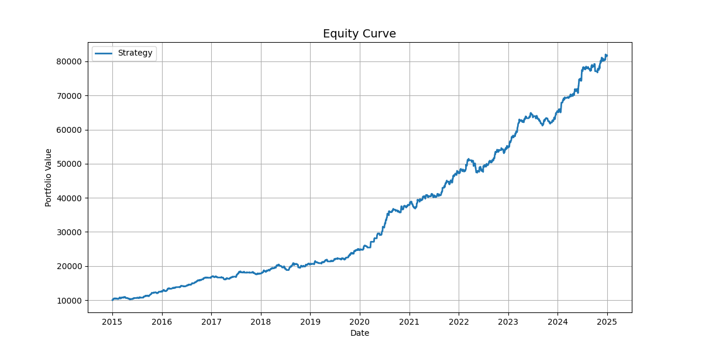
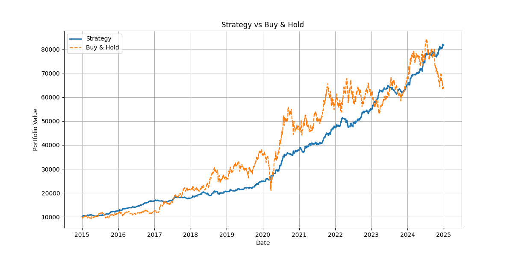
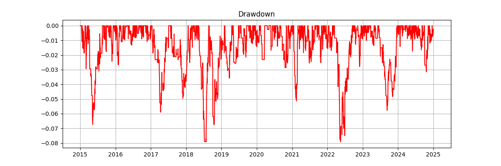

# 📊 Algorithmic Trading System with Risk Management

## 🚀 Overview
A quantitative trading system combining momentum and mean reversion strategies with risk management and backtesting.

---

## 📊 Real Backtest Results

Total Return: 7.16  
CAGR: 0.239  
Sharpe: 2.45  
Max Drawdown: -0.079  
Volatility: 0.089  

Total Trades: 257  
Win Rate: 0.354  
Avg Win: 0.037  
Avg Loss: -0.024  

---

## 🧠 Strategy

- Momentum (Moving Average crossover)  
- Mean Reversion (Z-score)  
- Combined signal filtering  

---

## ⚙️ Risk Management

- Stop Loss  
- Take Profit  
- Trailing Stop  
- Position sizing  

---

## 📈 Charts

  

---

## ▶️ Run

git clone https://github.com/abhi6019-dev/algorithmic-trading-system-with-risk-management  
cd algorithmic-trading-system-with-risk-management  
pip install -r requirements.txt  
python main.py  

---

## ⚠️ Notes

- Backtest only  
- No full cost/slippage modeling  
- Needs further validation  

---

## 👨‍💻 Author

Abhi(abhi6019-dev)